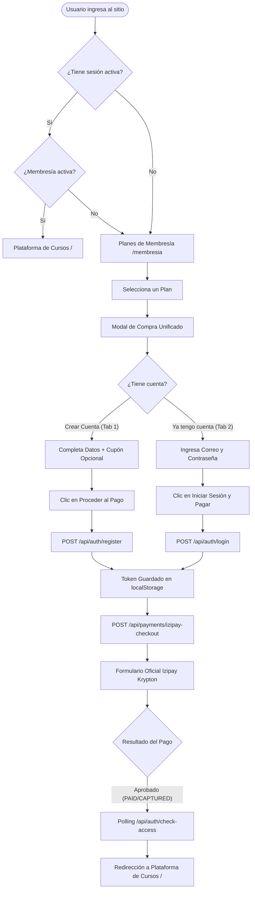
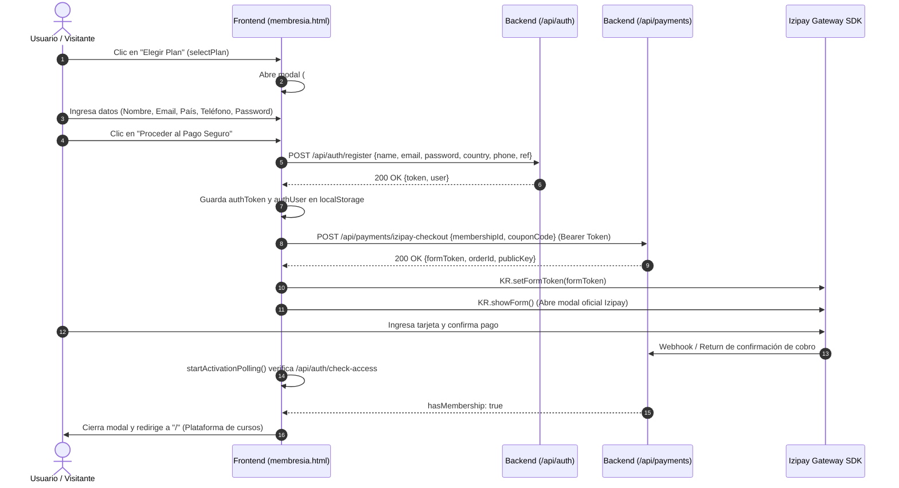

# Documentación Técnica: Sistema de Membresías y Registro Unificado

**Fecha**: 11 de Agosto de 2026  
**Plataforma**: IATIBET ZUREON / Web Cursos  
**Versión**: 2.0.0  

---

## 1. Resumen Ejecutivo

Se rediseñó la arquitectura de adquisición de usuarios y venta de membresías. Anteriormente, el usuario debía registrarse previamente en una página aislada (`/register`) antes de poder comprar una membresía.

Con la nueva implementación:
1. **Página Principal para Visitantes**: Cualquier visitante no autenticado que ingrese al dominio principal (`/`) o mediante enlaces de referidos es dirigido directamente a la página de **Planes de Membresía** (`/membresia`).
2. **Creación de Cuenta Integrada en la Compra**: Al seleccionar cualquier plan, se abre un modal unificado donde el usuario ingresa sus datos (nombre, correo, país, celular, contraseña). La cuenta se crea automáticamente en segundo plano y se conecta de forma inmediata con la pasarela de pagos oficial de **Izipay**.
3. **Acceso Directo para Usuarios Registrados**: Quienes ya cuentan con usuario y membresía activa inician sesión en `/login` y acceden directamente al catálogo completo de cursos (`/`).

---

## 2. Arquitectura de Flujos de Usuario



---

## 3. Diagrama de Secuencia Técnico (Checkout Unificado)



---

## 4. Detalle de Archivos Modificados y Funcionalidades

### 4.1. `public/index.html` (Zero-Flash Head Redirect)
- **Problema previo**: Un guard al pie del archivo causaba un parpadeo visual del catálogo de cursos antes de redirigir a `/membresia`.
- **Solución técnica**:
  ```html
  <head>
    <script>
      (function () {
        var token = localStorage.getItem('authToken');
        if (!token) {
          document.documentElement.style.display = 'none';
          var qs = window.location.search || '';
          window.location.replace('/membresia' + qs);
        }
      })();
    </script>
    ...
  ```
  - Se ejecuta en el **hilo principal de análisis de HTML (HEAD)** antes de parsear estilos, fuentes o el DOM.
  - `document.documentElement.style.display = 'none'` previene el renderizado del primer frame.
  - `window.location.replace()` redirige instantáneamente sin generar entradas intermedias en el historial de navegación.

### 4.2. `public/membresia.html` (Modal Unificado y Lógica Reactiva)
- **Componentes y Elementos**:
  - **Selector de Pestañas**: `#tabRegisterBtn` ("📝 1. Crear Cuenta") y `#tabLoginBtn` ("🔑 Ya tengo cuenta").
  - **Formulario de Registro**: Inputs para Nombre, Correo, Selector de País (con mapeo automático a código telefónico internacional), Teléfono, Contraseña con barra dinámica de fortaleza, Confirmación de Contraseña y Términos y Condiciones.
  - **Formulario de Login Rápido**: Inputs optimizados para autenticación dentro del modal.
  - **Caja de Usuario Autenticado**: Si ya existe sesión, muestra avatar, nombre, correo y opción de cambio de cuenta.
  - **Aplicación de Cupones**: Input dinámico que valida contra `POST /api/coupons/validate` y recalcula precios en tiempo real.
- **Funciones Principales**:
  - `selectPlan(id, name, price, durationDays)`: Configura el plan elegido, sincroniza el color temático del botón y abre `#confirmModal`.
  - `handleCheckoutSubmit()`: Orquesta la validación, llamada a `/api/auth/register` (o `/api/auth/login`), actualización de credenciales e invocación a `startIzipayCheckout()`.
  - `startIzipayCheckout()`: Obtiene el `formToken` y levanta el SDK Krypton (`#izipayOfficialModal`).
  - `startActivationPolling()`: Consulta periódicamente `/api/auth/check-access` tras el pago para redirigir a `/` en cuanto se detecta la membresía activa.

### 4.3. `public/script.js` (Captura Global de Referidos)
- **Función autoejecutable (IIFE)**:
  ```javascript
  (function captureReferral() {
      try {
          const ref = new URLSearchParams(window.location.search).get('ref');
          if (ref) localStorage.setItem('referralCode', ref.trim());
      } catch (e) {}
  })();
  ```
  Garantiza que si un visitante llega con `?ref=CODIGO` a cualquier página, el código queda persistido para registrar la comisión del afiliado al momento del pago.

### 4.4. `public/vendedor.html`
- Los enlaces de afiliados generados en el panel ahora apuntan a:
  `${window.location.origin}/membresia?ref=${stats.code}`

### 4.5. `public/register.html`
- Redirección automática inmediata en `<head>` hacia `/membresia${qs}` preservando todos los parámetros de consulta (`?plan=...`, `?ref=...`).

---

## 5. Endpoints Backend Clave

| Endpoint | Método | Autenticación | Descripción |
| :--- | :---: | :---: | :--- |
| `/api/auth/register` | `POST` | Pública | Registra nuevo usuario con `{ name, email, password, country, phone, ref }`. Devuelve JWT y objeto `user`. |
| `/api/auth/login` | `POST` | Pública | Inicia sesión con `{ email, password }`. Devuelve JWT y objeto `user`. |
| `/api/payments/izipay-checkout` | `POST` | Bearer Token | Genera orden de cobro en Izipay con `{ membershipId, couponCode }`. Devuelve `formToken`. |
| `/api/auth/check-access` | `GET` | Bearer Token | Retorna `{ hasMembership, membershipPlan, membershipExpiresAt }`. Usado para polling post-pago. |
| `/api/coupons/validate` | `POST` | Opcional | Valida código de descuento y devuelve precios recalculados. |

---

## 6. Manejo de Seguridad y Casos Borde

1. **Correos ya registrados durante el registro**:
   Si el usuario intenta registrar un correo existente, el modal muestra un aviso claro recomendándole usar la pestaña *"🔑 Ya tengo cuenta"*.
2. **Persistencia de Referidos**:
   El código de afiliado se busca en la URL y como fallback en `localStorage.getItem('referralCode')`, evitando pérdidas de atribución si el usuario navega entre pestañas.
3. **Manejo de AdBlockers / SDK Izipay**:
   Detección reactiva de la carga de `window.KR` con avisos de advertencia si un bloqueador de anuncios interfiere con la pasarela.
4. **Token de Tarjeta para Recurrencia**:
   `KR.onOrderUpdate` captura el `paymentMethodToken` de transacciones `PAID`/`AUTHORISED` y lo registra en `/api/payments/izipay-save-token`.
